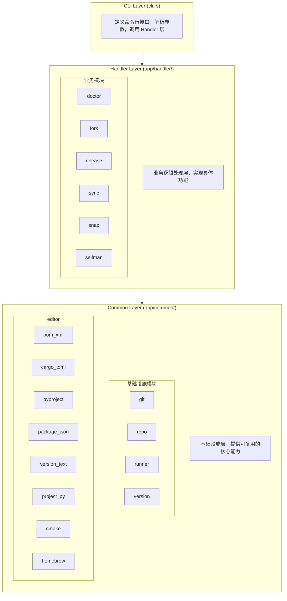
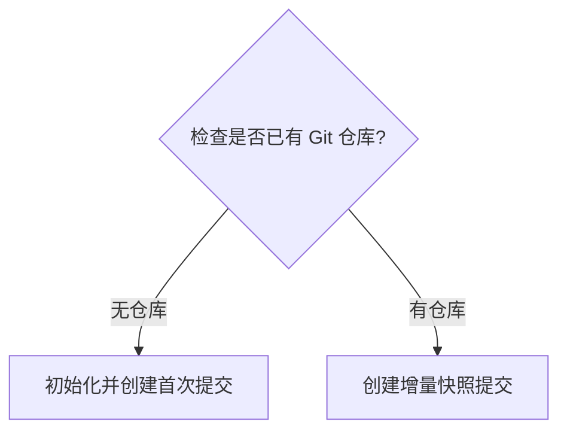
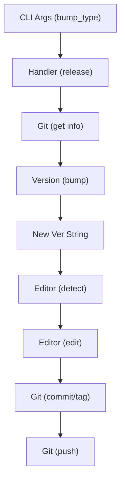
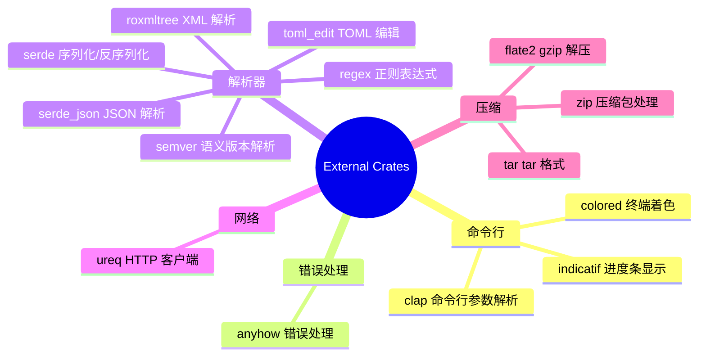
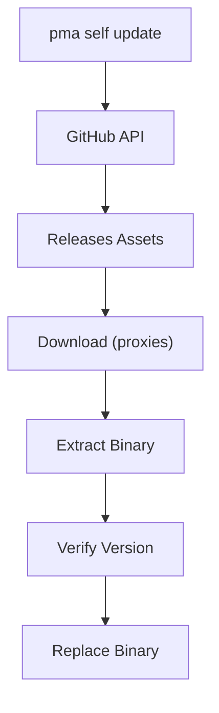

# PMA 软件架构设计

## 概述

PMA (Project Manager Application) 是一个命令行工具，用于管理多个代码仓库的版本发布、同步、诊断等操作。本文档描述 PMA 的软件架构设计。

## 架构总览



## 模块设计

### 1. CLI Layer (命令行层)

**文件**: `src/cli.rs`, `src/main.rs`

**职责**:
- 定义命令行接口结构
- 解析命令行参数
- 路由到对应的 Handler

**命令列表**:

| 命令 | 别名 | 功能 |
|------|------|------|
| `release` | `re` | 发布新版本 |
| `sync` | `s` | 同步所有代码仓库 |
| `doctor` | - | 诊断项目健康状态 |
| `fork` | - | 从模板创建新项目 |
| `snap` | - | 创建项目快照 |
| `self update` | `self up` | 更新自身 |
| `self version` | `self ver` | 显示版本信息 |

### 2. Handler Layer (业务处理层)

**目录**: `src/app/handler/`

#### 2.1 release 模块

**文件**: `release.rs`

**功能**: 自动化版本发布流程


**支持的配置文件**:
- `Cargo.toml` (Rust)
- `pom.xml` (Java/Maven)
- `pyproject.toml` (Python)
- `package.json` (Node.js)
- `CMakeLists.txt` (C/C++)
- `__version__.py` (Python)
- `version` / `version.txt` (纯文本)
- `Formula/pma.rb` (Homebrew)

#### 2.2 sync 模块

**文件**: `sync.rs`

**功能**: 批量同步多个 Git 仓库


#### 2.3 doctor 模块

**文件**: `doctor.rs`

**功能**: 项目健康诊断

**检查项**:
- 依赖工具检查 (git)
- Git 远程仓库命名规范化
- Git 垃圾回收

#### 2.4 fork 模块

**文件**: `fork.rs`

**功能**: 从模板项目创建新项目


#### 2.5 snap 模块

**文件**: `snap.rs`

**功能**: 项目快照备份



#### 2.6 selfman 模块

**文件**: `selfman.rs`

**功能**: 自身版本管理

**特性**:
- 从 GitHub Releases 获取最新版本
- 支持多种下载代理
- 原子性更新 (备份 + 恢复机制)
- 跨平台支持 (Linux, macOS, Windows)

### 3. Common Layer (基础设施层)

**目录**: `src/app/common/`

#### 3.1 git 模块

**文件**: `git.rs`

**功能**: Git 命令封装

**主要函数**:
| 函数 | 功能 |
|------|------|
| `get_rev_revision` | 获取引用的 revision |
| `get_current_version` | 获取最新版本标签 |
| `get_current_branch` | 获取当前分支名 |
| `get_remote_list` | 获取远程仓库列表 |
| `get_top_level_dir` | 获取仓库根目录 |
| `clone` | 克隆仓库 |
| `add_file` | 添加文件到暂存区 |
| `commit` | 提交更改 |
| `create_tag` | 创建标签 |
| `push_tag` | 推送标签 |
| `push_branch` | 推送分支 |
| `parse_git_remote_url` | 解析远程 URL |
| `get_remote_name_by_url` | 根据 URL 推断远程名称 |

#### 3.2 repo 模块

**文件**: `repo.rs`

**功能**: Git 仓库查找和遍历

**主要类型**:
```rust
pub enum RepoType {
    Regular,    // 普通仓库
    Submodule,  // 子模块
}

pub struct RepoInfo {
    pub path: PathBuf,
    pub repo_type: RepoType,
}
```

**主要函数**:
| 函数 | 功能 |
|------|------|
| `find_git_repositories` | 递归查找 Git 仓库 |
| `find_git_repositories_or_current` | 查找仓库或使用当前目录 |
| `for_each_repo` | 遍历仓库执行回调 |

#### 3.3 runner 模块

**文件**: `runner.rs`

**功能**: 命令执行器

**主要方法**:
```rust
impl CommandRunner {
    pub fn run_quiet(program, args) -> Result<Output>
    pub fn run_with_success(program, args) -> Result<Output>
    pub fn run_quiet_in_dir(program, args, dir) -> Result<Output>
    pub fn run_with_success_in_dir(program, args, dir) -> Result<Output>
}
```

#### 3.4 version 模块

**文件**: `version.rs`

**功能**: 版本号处理

**主要类型**:
```rust
pub struct Version {
    pub major: u32,
    pub minor: u32,
    pub patch: u32,
}
```

**主要函数**:
| 函数 | 功能 |
|------|------|
| `Version::from_tag` | 从标签解析版本号 |
| `Version::bump` | 递增版本号 |
| `Version::to_tag` | 转换为标签字符串 |
| `compare_versions` | 比较两个版本号 |

#### 3.5 editor 模块

**目录**: `editor/`

**功能**: 配置文件版本编辑器

**核心 Trait**:
```rust
pub trait ConfigEditor {
    fn parse(&self, content: &str) -> Result<VersionLocation, VersionEditError>;
    fn edit(&self, content: &str, location: &VersionLocation, new_version: &str) -> Result<String, VersionEditError>;
    fn validate(&self, original: &str, edited: &str) -> Result<(), VersionEditError>;
}
```

**编辑器列表**:

| 编辑器 | 文件 | 支持格式 |
|--------|------|----------|
| `PomXmlEditor` | `pom_xml.rs` | Maven pom.xml |
| `CargoTomlEditor` | `cargo_toml.rs` | Cargo.toml |
| `PyprojectEditor` | `pyproject.rs` | pyproject.toml |
| `PackageJsonEditor` | `package_json.rs` | package.json |
| `VersionTextEditor` | `version_text.rs` | 纯文本版本文件 |
| `PythonVersionEditor` | `project_py.rs` | Python __version__.py |
| `CMakeListsEditor` | `cmake.rs` | CMakeLists.txt |
| `HomebrewFormulaEditor` | `homebrew.rs` | Homebrew Formula |

**特性**:
- 格式保留 (缩进、换行符)
- 原子性写入 (备份 + 恢复)
- 格式验证

## 数据流

### Release 流程数据流



## 设计原则

### 1. 分层架构

- **CLI Layer**: 只负责参数解析和路由
- **Handler Layer**: 实现业务逻辑，不关心具体实现细节
- **Common Layer**: 提供可复用的基础设施

### 2. 单一职责

每个模块只负责一个明确的功能:
- `git.rs` 只封装 Git 命令
- `version.rs` 只处理版本号
- `editor/*` 每个编辑器只处理一种配置格式

### 3. 依赖倒置

Handler 层依赖 Common 层的抽象接口，而不是具体实现:
```rust
// Handler 使用 trait 而非具体类型
fn edit_with_editor<E: ConfigEditor>(editor: &E, ...) -> Result<String>
```

### 4. 错误处理

使用 `anyhow` 进行错误传播，提供上下文信息:
```rust
CommandRunner::run_with_success("git", &["tag", tag])
    .with_context(|| format!("无法创建标签 {}", tag))?;
```

## 扩展性

### 添加新的配置文件编辑器

1. 在 `src/app/common/editor/` 下创建新文件
2. 实现 `ConfigEditor` trait
3. 在 `editor/mod.rs` 中导出

### 添加新的命令

1. 在 `src/cli.rs` 中定义命令结构
2. 在 `src/app/handler/` 下创建新模块
3. 在 `src/main.rs` 中添加路由

## 依赖关系



## 部署架构

### 发布渠道

1. **GitHub Releases**: 主要发布渠道
2. **npm**: `@jeansoft/pma` 包
3. **Homebrew**: `Formula/pma.rb`

### 支持平台

| 平台 | 架构 | 格式 |
|------|------|------|
| Linux | x86_64 | tar.gz |
| macOS | x86_64, arm64 | tar.gz |
| Windows | x86_64, arm64 | zip |

### 更新机制


