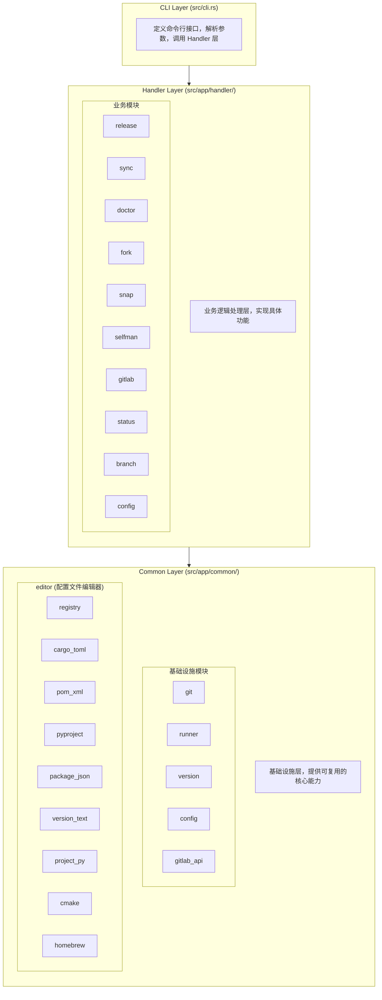
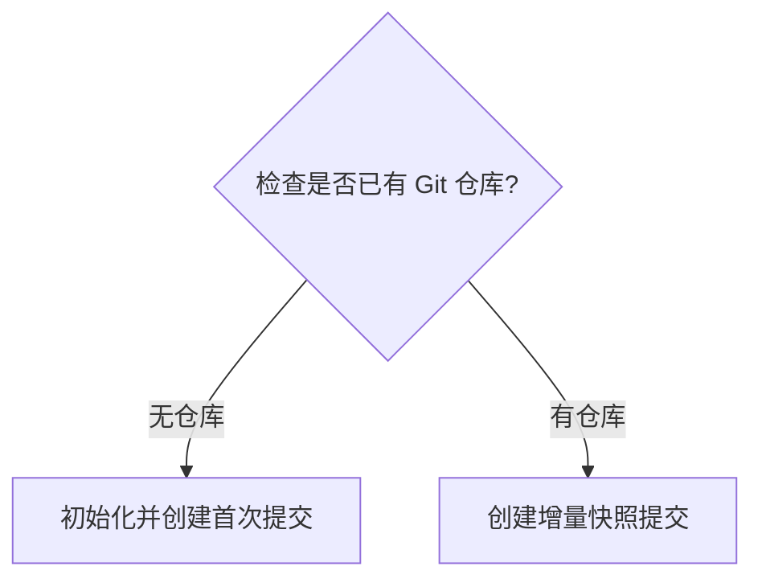
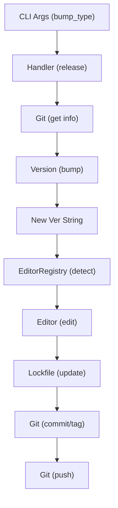
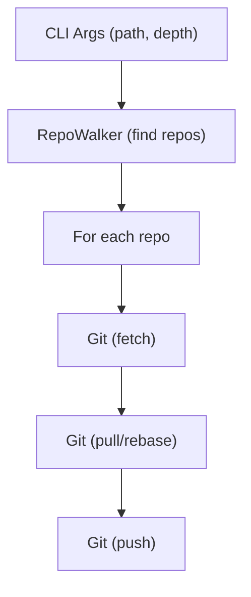
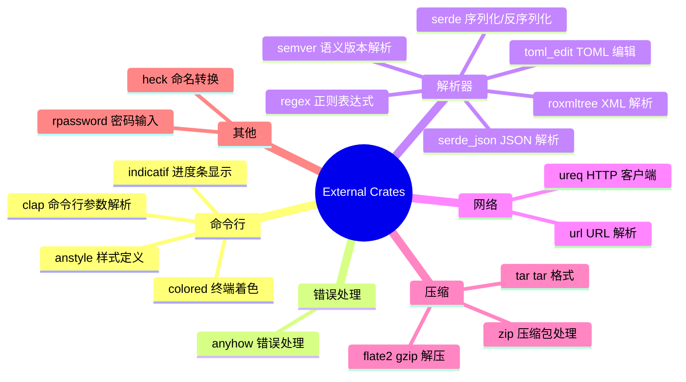
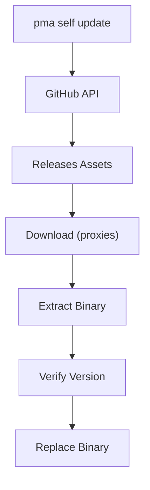

# PMA 软件架构设计

## 概述

PMA (Project Manager Application) 是一个用 Rust 编写的命令行工具，用于管理多个代码仓库的版本发布、同步、诊断等操作。本文档描述 PMA 的软件架构设计。

## 架构总览



## 模块设计

### 1. CLI Layer (命令行层)

**文件**: `src/cli.rs`, `src/main.rs`

**职责**:
- 定义命令行接口结构
- 解析命令行参数
- 路由到对应的 Handler

**命令列表**:

| 命令 | 别名 | 功能 |
|------|------|------|
| `release` | `re` | 发布新版本 |
| `sync` | `s` | 同步所有代码仓库 |
| `doctor` | - | 诊断项目健康状态 |
| `fork` | - | 从模板创建新项目 |
| `snap` | - | 创建项目快照 |
| `gitlab` | `gl` | GitLab 集成命令 |
| `status` | `st` | 显示仓库状态 |
| `branch` | `br` | 管理分支 |
| `self update` | `self up` | 更新自身 |
| `self version` | `self ver` | 显示版本信息 |
| `config` | - | 管理配置 |

### 2. Handler Layer (业务处理层)

**目录**: `src/app/handler/`

#### 2.1 release 模块

**文件**: `release/mod.rs`, `release/lockfile.rs`

**功能**: 自动化版本发布流程


**支持的配置文件**:
- `Cargo.toml` (Rust)
- `pom.xml` (Java/Maven)
- `pyproject.toml` (Python)
- `package.json` (Node.js)
- `CMakeLists.txt` (C/C++)
- `__version__.py` (Python)
- `version` / `version.txt` (纯文本)
- `Formula/pma.rb` (Homebrew)

#### 2.2 sync 模块

**文件**: `sync.rs`

**功能**: 批量同步多个 Git 仓库


#### 2.3 doctor 模块

**文件**: `doctor.rs`

**功能**: 项目健康诊断

**检查项**:
- 依赖工具检查 (git)
- Git 远程仓库命名规范化
- Git 垃圾回收

#### 2.4 fork 模块

**文件**: `fork.rs`

**功能**: 从模板项目创建新项目


#### 2.5 snap 模块

**文件**: `snap.rs`

**功能**: 项目快照备份



#### 2.6 gitlab 模块

**文件**: `gitlab.rs`

**功能**: GitLab 集成

**子命令**:
- `login`: 登录 GitLab 服务器
- `clone`: 克隆 GitLab 组下的所有仓库

#### 2.7 status 模块

**文件**: `status.rs`

**功能**: 显示仓库状态

**特性**:
- 显示分支信息
- 显示工作目录状态 (clean/dirty)
- 支持过滤 (dirty, clean, ahead, behind)

#### 2.8 branch 模块

**文件**: `branch.rs`

**功能**: 批量管理分支

**子命令**:
- `list`: 列出所有分支
- `clean`: 清理已合并分支
- `switch`: 切换分支
- `rename`: 重命名分支

#### 2.9 config 模块

**文件**: `config.rs`

**功能**: 配置管理

**子命令**:
- `init`: 初始化配置文件
- `show`: 显示当前配置
- `path`: 显示配置文件路径

#### 2.10 selfman 模块

**文件**: `selfman.rs`

**功能**: 自身版本管理

**特性**:
- 从 GitHub Releases 获取最新版本
- 支持多种下载代理
- 原子性更新 (备份 + 恢复机制)
- 跨平台支持 (Linux, macOS, Windows)

### 3. Common Layer (基础设施层)

**目录**: `src/app/common/`

#### 3.1 git 模块

**目录**: `git/`

**文件**:
- `mod.rs`: 模块导出
- `command.rs`: Git 命令封装
- `remote.rs`: 远程仓库处理
- `repository.rs`: 仓库查找和遍历

**主要函数**:
| 函数 | 功能 |
|------|------|
| `get_rev_revision` | 获取引用的 revision |
| `get_current_version` | 获取最新版本标签 |
| `get_current_branch` | 获取当前分支名 |
| `get_remote_list` | 获取远程仓库列表 |
| `get_top_level_dir` | 获取仓库根目录 |
| `clone` | 克隆仓库 |
| `add_file` | 添加文件到暂存区 |
| `commit` | 提交更改 |
| `create_tag` | 创建标签 |
| `push_tag` | 推送标签 |
| `push_branch` | 推送分支 |
| `find_git_repositories` | 递归查找 Git 仓库 |
| `for_each_repo` | 遍历仓库执行回调 |

**RepoWalker 结构**:
```rust
pub struct RepoWalker {
    repos: Vec<RepoInfo>,
}

pub struct RepoInfo {
    pub path: PathBuf,
    pub repo_type: RepoType,
}

pub enum RepoType {
    Regular,    // 普通仓库
    Submodule,  // 子模块
}
```

#### 3.2 runner 模块

**文件**: `runner.rs`

**功能**: 命令执行器

**主要方法**:
```rust
impl CommandRunner {
    pub fn run_quiet(program, args) -> Result<Output>
    pub fn run_with_success(program, args) -> Result<Output>
    pub fn run_quiet_in_dir(program, args, dir) -> Result<Output>
    pub fn run_with_success_in_dir(program, args, dir) -> Result<Output>
}
```

**DryRunContext**:
```rust
pub struct DryRunContext {
    dry_run: bool,
}

impl DryRunContext {
    pub fn is_dry_run(&self) -> bool
    pub fn print_header(&self, msg: &str)
    pub fn print_message(&self, msg: &str)
    pub fn print_file_diff(&self, file: &str, original: &str, edited: &str)
}
```

#### 3.3 version 模块

**文件**: `version.rs`

**功能**: 版本号处理

**主要类型**:
```rust
pub struct Version {
    pub major: u32,
    pub minor: u32,
    pub patch: u32,
}
```

**主要函数**:
| 函数 | 功能 |
|------|------|
| `Version::from_tag` | 从标签解析版本号 |
| `Version::bump` | 递增版本号 |
| `Version::to_tag` | 转换为标签字符串 |
| `compare_versions` | 比较两个版本号 |

#### 3.4 config 模块

**文件**: `config.rs`

**功能**: 配置管理

**配置结构**:
```rust
pub struct AppConfig {
    pub repository: RepositoryConfig,
    pub remote: RemoteConfig,
    pub sync: SyncConfig,
}

pub struct GitLabConfig {
    pub servers: Vec<GitLabServer>,
}
```

**配置文件位置**:
- 主配置: `~/.pma/config.toml`
- GitLab 配置: `~/.pma/gitlab.toml`
- 环境变量: `PMA_CONFIG_DIR`

#### 3.5 gitlab_api 模块

**目录**: `gitlab_api/`

**文件**:
- `mod.rs`: 模块导出
- `client.rs`: GitLab API 客户端
- `groups.rs`: 组查询
- `projects.rs`: 项目查询
- `users.rs`: 用户信息

**主要类型**:
```rust
pub struct GitLabClient {
    // GitLab API 客户端
}

pub struct GroupQuery {
    // 组查询
}

pub struct ProjectsQuery {
    // 项目查询
}
```

#### 3.6 editor 模块

**目录**: `editor/`

**功能**: 配置文件版本编辑器

**核心 Trait**:
```rust
pub trait ConfigEditor: Send + Sync {
    fn name(&self) -> &'static str;
    fn file_patterns(&self) -> &[&str];
    fn matches_file(&self, path: &Path) -> bool;
    fn parse(&self, content: &str) -> Result<VersionLocation, VersionEditError>;
    fn edit(&self, content: &str, location: &VersionLocation, new_version: &str) -> Result<String, VersionEditError>;
    fn validate(&self, original: &str, edited: &str) -> Result<(), VersionEditError>;
}
```

**编辑器列表**:

| 编辑器 | 文件 | 支持格式 |
|--------|------|----------|
| `CargoTomlEditor` | `cargo_toml.rs` | Cargo.toml |
| `PomXmlEditor` | `pom_xml.rs` | Maven pom.xml |
| `PyprojectEditor` | `pyproject.rs` | pyproject.toml |
| `PackageJsonEditor` | `package_json.rs` | package.json |
| `VersionTextEditor` | `version_text.rs` | 纯文本版本文件 |
| `PythonVersionEditor` | `project_py.rs` | Python __version__.py |
| `CMakeListsEditor` | `cmake.rs` | CMakeLists.txt |
| `HomebrewFormulaEditor` | `homebrew.rs` | Homebrew Formula |

**EditorRegistry**:
```rust
pub struct EditorRegistry {
    editors: HashMap<&'static str, Arc<dyn ConfigEditor>>,
    file_pattern_map: HashMap<String, &'static str>,
}

impl EditorRegistry {
    pub fn new() -> Self
    pub fn register(self, editor: impl ConfigEditor + 'static) -> Self
    pub fn detect_editor(&self, path: &Path) -> Option<Arc<dyn ConfigEditor>>
    pub fn edit_version(&self, editor: &dyn ConfigEditor, content: &str, version: &str) -> Result<String>
}
```

**特性**:
- 格式保留 (缩进、换行符)
- 原子性写入 (备份 + 恢复)
- 格式验证

## 数据流

### Release 流程数据流



### Sync 流程数据流



## 设计原则

### 1. 分层架构

- **CLI Layer**: 只负责参数解析和路由
- **Handler Layer**: 实现业务逻辑，不关心具体实现细节
- **Common Layer**: 提供可复用的基础设施

### 2. 单一职责

每个模块只负责一个明确的功能:
- `git/` 只封装 Git 命令
- `version.rs` 只处理版本号
- `editor/*` 每个编辑器只处理一种配置格式

### 3. 依赖倒置

Handler 层依赖 Common 层的抽象接口，而不是具体实现:
```rust
// Handler 使用 trait 而非具体类型
fn edit_with_editor<E: ConfigEditor>(editor: &E, ...) -> Result<String>
```

### 4. 错误处理

使用 `anyhow` 进行错误传播，提供上下文信息:
```rust
CommandRunner::run_with_success("git", &["tag", tag])
    .with_context(|| format!("无法创建标签 {}", tag))?;
```

## 扩展性设计

### 核心扩展机制

#### 1. ConfigEditor Trait

所有配置文件编辑器实现统一的 trait：

```rust
pub trait ConfigEditor: Send + Sync {
    fn name(&self) -> &'static str;
    fn file_patterns(&self) -> &[&str];
    fn matches_file(&self, path: &Path) -> bool;
    fn parse(&self, content: &str) -> Result<VersionLocation, VersionEditError>;
    fn edit(&self, content: &str, location: &VersionLocation, new_version: &str) -> Result<String, VersionEditError>;
    fn validate(&self, original: &str, edited: &str) -> Result<(), VersionEditError>;
}
```

#### 2. EditorRegistry

编辑器注册表支持动态注册和自动检测：

```rust
let registry = EditorRegistry::new()
    .register(CargoTomlEditor)
    .register(PomXmlEditor)
    .register(PyprojectEditor)
    // ... 更多编辑器
    ;

// 自动检测文件类型
let editor = registry.detect_editor(Path::new("Cargo.toml"));

// 编辑版本
let edited = registry.edit_version(editor.as_ref(), content, "1.0.0")?;
```

### 添加新的配置文件编辑器

1. 在 `src/app/common/editor/` 下创建新文件
2. 实现 `ConfigEditor` trait
3. 在 `editor/mod.rs` 中导出
4. 在 `release/mod.rs` 的 `create_editor_registry()` 中注册

**示例**：

```rust
// src/app/common/editor/my_config.rs
use super::{ConfigEditor, VersionEditError, VersionLocation, VersionPosition};
use std::path::Path;

pub struct MyConfigEditor;

impl ConfigEditor for MyConfigEditor {
    fn name(&self) -> &'static str { "my_config" }
    fn file_patterns(&self) -> &[&str] { &["my.config"] }
    fn matches_file(&self, path: &Path) -> bool {
        path.file_name().and_then(|n| n.to_str()) == Some("my.config")
    }
    fn parse(&self, content: &str) -> Result<VersionLocation, VersionEditError> {
        // 解析逻辑
    }
    fn edit(&self, content: &str, location: &VersionLocation, new_version: &str) -> Result<String, VersionEditError> {
        // 编辑逻辑
    }
    fn validate(&self, original: &str, edited: &str) -> Result<(), VersionEditError> {
        // 验证逻辑
    }
}
```

### 添加新的命令

1. 在 `src/cli.rs` 中定义命令结构
2. 在 `src/app/handler/` 下创建新模块
3. 在 `src/main.rs` 中添加路由

### 文件检测优先级

1. **模式匹配**: 根据文件名和路径匹配 `file_patterns()`
2. **自定义匹配**: 调用 `matches_file()` 进行复杂匹配
3. **后备检测**: 遍历所有注册的编辑器

## 依赖关系



## 部署架构

### 发布渠道

1. **GitHub Releases**: 主要发布渠道
2. **npm**: `@jeansoft/pma` 包
3. **Homebrew**: `Formula/pma.rb`

### 支持平台

| 平台 | 架构 | 格式 |
|------|------|------|
| Linux | x86_64 | tar.gz |
| macOS | x86_64, arm64 | tar.gz |
| Windows | x86_64, arm64 | zip |

### 更新机制



## 配置系统

### 配置文件结构

**主配置文件** (`~/.pma/config.toml`):
```toml
[repository]
max_depth = 3
skip_dirs = [".venv", "node_modules", "target", ...]

[[remote.rules]]
hosts = ["github.com"]
name = "github"

[sync]
skip_push_hosts = ["github.com", "gitee.com"]
```

**GitLab 配置文件** (`~/.pma/gitlab.toml`):
```toml
[[servers]]
url = "https://gitlab.com"
token = "glpat-xxxx"
protocol = "ssh"
```

### 配置迁移

支持从旧配置文件 (`~/.pma.toml`) 自动迁移到新目录结构 (`~/.pma/`)。

## 测试策略

### 单元测试

- 每个模块应有对应的单元测试
- 使用 `#[cfg(test)]` 模块
- 测试边界条件和错误处理

### 集成测试

- 测试命令行接口
- 测试端到端流程
- 使用临时目录进行隔离

### Dry Run 模式

所有修改操作都支持 `--dry-run` 参数，用于预览变更而不实际执行。
