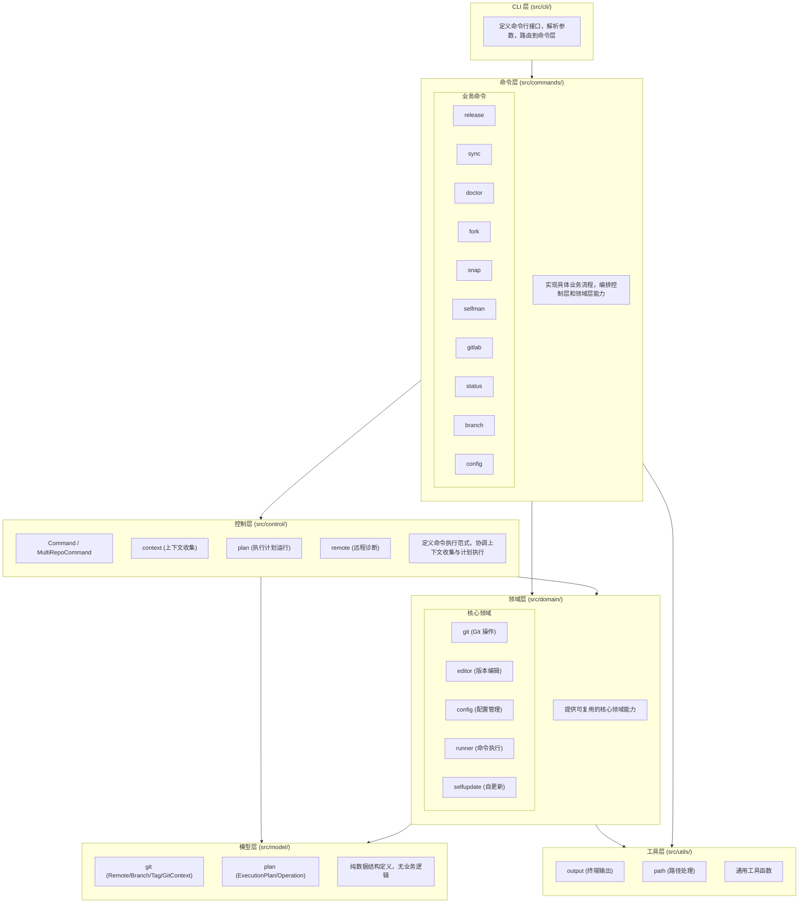
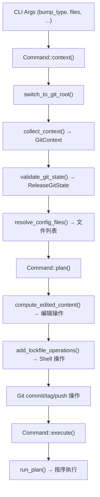
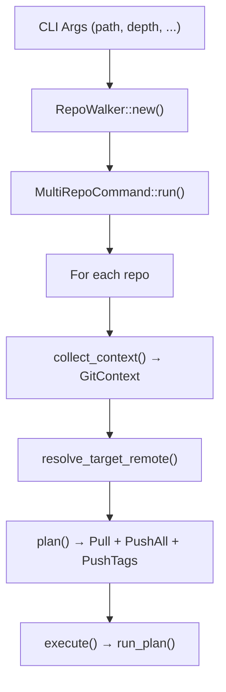
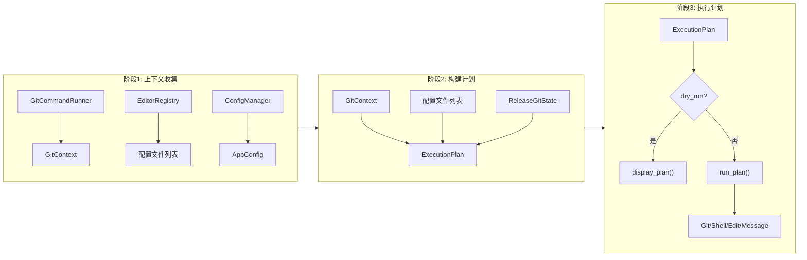
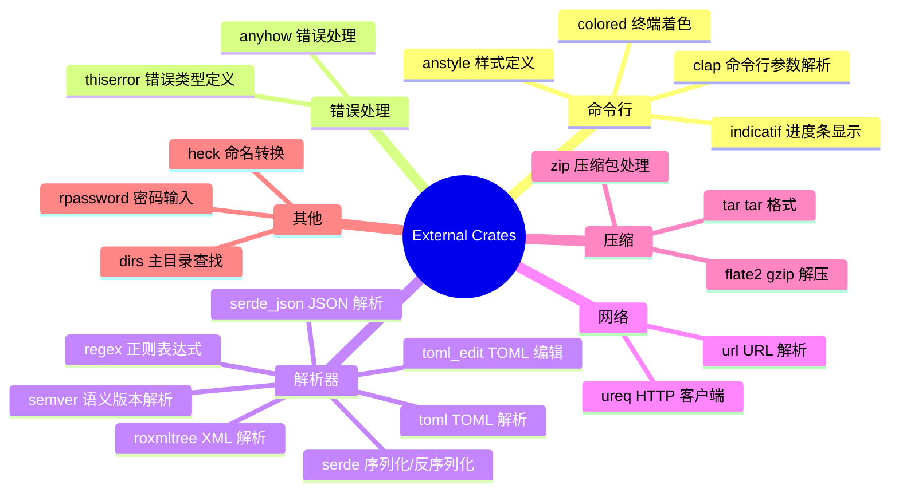
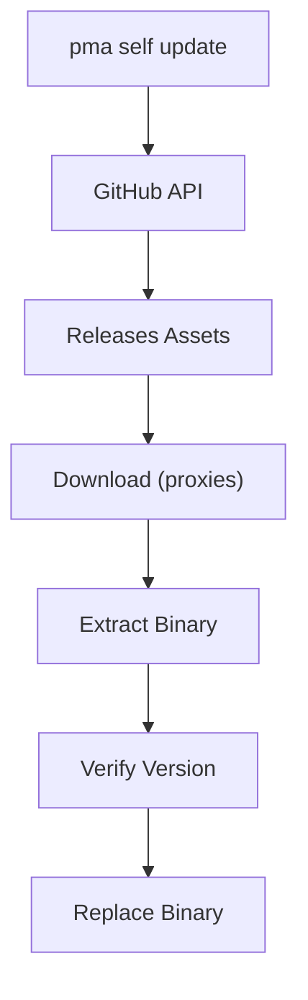

# PMA 软件架构设计

## 概述

PMA (Project Manager Application) 是一个用 Rust 编写的命令行工具，用于管理多个代码仓库的版本发布、同步、诊断等操作。本文档描述 PMA 的软件架构设计。

## 架构总览

PMA 采用五层架构，遵循"上下文收集 → 执行计划 → 执行命令"三阶段模式：



### 三阶段执行模式

所有命令遵循统一的三阶段执行模式：


1. **上下文收集**: 收集执行所需的所有信息（Git 状态、配置文件、远程仓库等）
2. **构建执行计划**: 根据上下文生成 `ExecutionPlan`，包含有序的操作列表
3. **执行计划**: 按序执行计划中的操作，支持 dry-run 模式

### 控制层 Trait

```rust
trait Command {
    type Context;
    fn context(&self) -> Result<Self::Context>;
    fn plan(&self, ctx: &Self::Context) -> Result<ExecutionPlan>;
    fn execute(plan: &ExecutionPlan) -> Result<()>;
    fn run(&self) -> Result<()> { ... }
}

trait MultiRepoCommand {
    type Context;
    fn context(&self, repo_path: &Path) -> Result<Self::Context>;
    fn plan(&self, ctx: &Self::Context) -> Result<ExecutionPlan>;
    fn execute(plan: &ExecutionPlan) -> Result<()>;
    fn run(&self, walker: &RepoWalker) -> Result<()> { ... }
}
```

## 模块设计

### 1. CLI 层

**目录**: `src/cli/`

**文件**:
- `mod.rs`: 模块导出、样式定义
- `commands.rs`: clap derive 命令定义、参数路由

**职责**:
- 定义命令行接口结构（clap derive 模式）
- 解析命令行参数
- 路由到对应的命令处理函数

**命令列表**:

| 命令 | 别名 | 功能 |
|------|------|------|
| `release` | `re` | 发布新版本 |
| `sync` | `s` | 同步所有代码仓库 |
| `doctor` | - | 诊断项目健康状态 |
| `fork` | - | 从模板创建新项目 |
| `snap` | - | 创建项目快照 |
| `gitlab` | `gl` | GitLab 集成命令 |
| `status` | `st` | 显示仓库状态 |
| `branch` | `br` | 管理分支 |
| `self update` | `self up` | 更新自身 |
| `self version` | `self ver` | 显示版本信息 |
| `config` | - | 管理配置 |

### 2. 命令层

**目录**: `src/commands/`

**职责**: 实现具体业务流程，通过实现 `Command` 或 `MultiRepoCommand` trait 编排控制层和领域层能力

#### 2.1 release 模块

**文件**: `release.rs`

**功能**: 自动化版本发布流程

实现 `Command` trait，三阶段流程：
1. **context**: 切换到 Git 根目录 → 收集 Git 上下文 → 验证 Git 状态 → 检测配置文件
2. **plan**: 为每个配置文件生成编辑操作 → 生成 lockfile 更新操作 → 生成 git commit/tag/push 操作
3. **execute**: 按计划执行


**支持的配置文件**:
- `Cargo.toml` (Rust)
- `pom.xml` (Java/Maven)
- `pyproject.toml` (Python)
- `package.json` (Node.js)
- `CMakeLists.txt` (C/C++)
- `__version__.py` (Python)
- `version` / `version.txt` (纯文本)
- `Formula/pma.rb` (Homebrew)

#### 2.2 sync 模块

**文件**: `sync.rs`

**功能**: 批量同步多个 Git 仓库

实现 `MultiRepoCommand` trait，对每个仓库：
1. **context**: 收集 Git 上下文 → 解析目标远程仓库
2. **plan**: 生成 pull → push --all → push --tags 操作
3. **execute**: 按计划执行

#### 2.3 doctor 模块

**文件**: `doctor.rs`

**功能**: 项目健康诊断

**检查项**:
- HEAD 是否 detached
- 是否配置了远程仓库
- 是否有远程跟踪分支
- 本地分支数量
- 是否存在 stash 条目
- 远程引用是否陈旧
- 仓库大小是否过大
- 远程仓库命名规范化

#### 2.4 fork 模块

**文件**: `fork.rs`

**功能**: 从模板项目创建新项目

#### 2.5 snap 模块

**文件**: `snap.rs`

**功能**: 项目快照备份

#### 2.6 gitlab 模块

**文件**: `gitlab.rs`

**功能**: GitLab 集成

**子命令**:
- `login`: 登录 GitLab 服务器
- `clone`: 克隆 GitLab 组下的所有仓库

#### 2.7 status 模块

**文件**: `status.rs`

**功能**: 显示仓库状态

**特性**:
- 显示分支信息
- 显示工作目录状态 (clean/dirty)
- 支持过滤 (dirty, clean, ahead, behind)

#### 2.8 branch 模块

**文件**: `branch.rs`

**功能**: 批量管理分支

**子命令**:
- `list`: 列出所有分支
- `clean`: 清理已合并分支
- `switch`: 切换分支
- `rename`: 重命名分支

#### 2.9 config 模块

**文件**: `config.rs`

**功能**: 配置管理

**子命令**:
- `init`: 初始化配置文件
- `show`: 显示当前配置
- `path`: 显示配置文件路径

#### 2.10 selfman 模块

**文件**: `selfman.rs`

**功能**: 自身版本管理

**特性**:
- 从 GitHub Releases 获取最新版本
- 支持多种下载代理
- 原子性更新 (备份 + 恢复机制)
- 跨平台支持 (Linux, macOS, Windows)

### 3. 控制层

**目录**: `src/control/`

**职责**: 定义命令执行范式，协调上下文收集与计划执行

#### 3.1 command 模块

**文件**: `command.rs`

**核心 Trait**:

```rust
trait Command {
    type Context;
    fn context(&self) -> Result<Self::Context>;
    fn plan(&self, ctx: &Self::Context) -> Result<ExecutionPlan>;
    fn execute(plan: &ExecutionPlan) -> Result<()>;
}

trait MultiRepoCommand {
    type Context;
    fn context(&self, repo_path: &Path) -> Result<Self::Context>;
    fn plan(&self, ctx: &Self::Context) -> Result<ExecutionPlan>;
    fn execute(plan: &ExecutionPlan) -> Result<()>;
}
```

- `Command`: 单仓库命令范式（如 release）
- `MultiRepoCommand`: 多仓库命令范式（如 sync、status、branch、doctor），自动遍历仓库并处理错误

#### 3.2 context 模块

**文件**: `context.rs`

**功能**: 重新导出 `domain::git::collect_context`，提供统一的上下文收集入口

#### 3.3 plan 模块

**文件**: `plan.rs`

**功能**: 执行计划运行器

- `run_plan()`: 执行 `ExecutionPlan`，支持 dry-run 模式
- `display_plan()`: 仅展示计划内容（dry-run 时使用）
- 分派四种操作类型：Git、Shell、Edit、Message

#### 3.4 remote 模块

**文件**: `remote.rs`

**功能**: 重新导出 `domain::git` 中的远程诊断功能

### 4. 领域层

**目录**: `src/domain/`

**职责**: 提供可复用的核心领域能力

#### 4.1 git 模块

**目录**: `domain/git/`

**文件**:
- `mod.rs`: 模块导出、`GitError` 定义
- `command.rs`: `GitCommandRunner` (基于 `CommandRunner` 封装 Git 命令)
- `context.rs`: `collect_context()` (收集完整 Git 上下文)
- `remote.rs`: 远程仓库命名诊断
- `repository.rs`: `RepoWalker` / `RepoInfo` (仓库查找和遍历)
- `release.rs`: Release 专用 Git 状态验证
- `diagnose.rs`: 仓库健康诊断

**GitCommandRunner**:

```rust
impl GitCommandRunner {
    pub fn execute(&self, args: &[&str], dir: Option<&Path>) -> Result<String>
    pub fn execute_with_success(&self, args: &[&str], dir: Option<&Path>) -> Result<()>
    pub fn execute_streaming(&self, args: &[&str], dir: &Path) -> Result<()>
    pub fn execute_raw(&self, args: &[&str], dir: &Path) -> Result<ProcessOutput>
    pub fn get_current_branch(&self, repo_path: &Path) -> Result<String>
    pub fn get_remote_list(&self, repo_path: &Path) -> Result<Vec<String>>
    pub fn has_uncommitted_changes(&self, repo_path: &Path) -> Result<bool>
    pub fn is_merged_branch(&self, name: &str, repo_path: &Path) -> bool
}
```

**RepoWalker**:

```rust
pub struct RepoWalker {
    repos: Vec<RepoInfo>,
}

pub struct RepoInfo {
    pub path: PathBuf,
}

impl RepoWalker {
    pub fn new(path: &Path, max_depth: usize) -> Result<Self>
    pub fn is_empty(&self) -> bool
    pub fn total(&self) -> usize
    pub fn repositories(&self) -> &[RepoInfo]
}
```

#### 4.2 editor 模块

**目录**: `domain/editor/`

**功能**: 配置文件版本编辑器

**核心 Trait**:

```rust
pub trait FileEditor: Send + Sync {
    fn name(&self) -> &str;
    fn file_patterns(&self) -> &[&str];
    fn find_version(&self, content: &str) -> Option<VersionPosition>;
    fn matches_file(&self, path: &Path) -> bool { ... }
    fn parse(&self, content: &str) -> Result<VersionLocation> { ... }
    fn edit(&self, content: &str, location: &VersionLocation, new_version: &str) -> Result<String> { ... }
    fn validate(&self, original: &str, edited: &str) -> Result<()> { ... }
}
```

**编辑器列表**:

| 编辑器 | 文件 | 支持格式 |
|--------|------|----------|
| `CargoTomlEditor` | `cargo_toml.rs` | Cargo.toml |
| `PomXmlEditor` | `pom_xml.rs` | Maven pom.xml |
| `PyprojectEditor` | `pyproject.rs` | pyproject.toml |
| `PackageJsonEditor` | `package_json.rs` | package.json |
| `VersionTextEditor` | `version_text.rs` | 纯文本版本文件 |
| `PythonVersionEditor` | `project_py.rs` | Python __version__.py |
| `CMakeListsEditor` | `cmake.rs` | CMakeLists.txt |
| `HomebrewFormulaEditor` | `homebrew.rs` | Homebrew Formula |

**EditorRegistry**:

```rust
pub struct EditorRegistry {
    editors: Vec<Box<dyn FileEditor>>,
}

impl EditorRegistry {
    pub fn new() -> Self
    pub fn default_with_editors() -> Self
    pub fn register(self, editor: impl FileEditor + 'static) -> Self
    pub fn detect_editor(&self, path: &Path) -> Option<&dyn FileEditor>
}
```

**detect 模块** (`detect.rs`):

- `resolve_config_files()`: 解析用户指定的文件列表，或自动检测配置文件
- `detect_config_files()`: 按候选列表自动检测可编辑的配置文件
- `compute_edited_content()`: 计算编辑后的文件内容
- `add_lockfile_operations()`: 为 Cargo.toml / package.json 添加 lockfile 更新操作

**version_bump 模块** (`version_bump.rs`):

```rust
pub enum BumpType { Major, Minor, Patch }

pub struct Version {
    pub major: u32,
    pub minor: u32,
    pub patch: u32,
}

impl Version {
    pub fn parse(s: &str) -> Result<Self>
    pub fn from_tag(tag: &str) -> Option<Self>
    pub fn bump(&self, bump_type: &BumpType) -> Self
    pub fn to_tag(&self) -> String
}
```

**特性**:
- 格式保留 (缩进、换行符、键序)
- 原子性写入 (备份 + 恢复)
- 格式验证

#### 4.3 config 模块

**目录**: `domain/config/`

**文件**:
- `mod.rs`: 模块导出
- `schema.rs`: `AppConfig` / `GitLabConfig` 结构定义
- `manager.rs`: `ConfigManager` (配置加载、迁移、持久化)

**ConfigManager**:

```rust
impl ConfigManager {
    pub fn base_dir() -> PathBuf
    pub fn config_path() -> PathBuf
    pub fn gitlab_path() -> PathBuf
    pub fn ensure_dir() -> io::Result<()>
    pub fn load_config() -> AppConfig
    pub fn load_gitlab() -> GitLabConfig
}
```

- 使用 `OnceLock` 缓存配置，全局只加载一次
- 支持从旧配置文件 (`~/.pma.toml`) 自动迁移到新目录结构 (`~/.pma/`)

#### 4.4 runner 模块

**目录**: `domain/runner/`

**文件**:
- `mod.rs`: `ExecutionContext` / `CommandResult` / `OutputMode` 定义
- `command.rs`: `CommandRunner` (通用命令执行器)

**ExecutionContext**:

```rust
pub struct ExecutionContext {
    pub program: String,
    pub args: Vec<String>,
    pub working_dir: Option<PathBuf>,
    pub output_mode: OutputMode,
}
```

**CommandRunner**:

```rust
impl CommandRunner {
    pub fn execute(&self, context: &ExecutionContext) -> Result<CommandResult>
}
```

支持两种输出模式：
- `Capture`: 捕获 stdout/stderr 到字符串
- `Streaming`: 实时输出到终端

#### 4.5 selfupdate 模块

**目录**: `domain/selfupdate/`

**文件**:
- `mod.rs`: 模块导出
- `updater.rs`: 自更新实现

**导出函数**:
- `fetch_latest_release()`: 从 GitHub API 获取最新版本
- `get_asset_name()`: 获取对应平台的资源文件名
- `download_asset()`: 下载更新包
- `install_binary()`: 安装新版本二进制文件

### 5. 模型层

**目录**: `src/model/`

**职责**: 纯数据结构定义，无业务逻辑

#### 5.1 git 模型

**文件**: `git.rs`

```rust
pub struct Remote {
    pub name: String,
    pub url: String,
}

pub struct Branch {
    pub name: String,
    pub is_current: bool,
    pub is_remote: bool,
    pub tracking_branch: Option<String>,
}

pub struct Tag {
    pub name: String,
}

pub struct GitContext {
    pub current_branch: String,
    pub remotes: Vec<Remote>,
    pub branches: Vec<Branch>,
    pub tags: Vec<Tag>,
    pub has_uncommitted_changes: bool,
}
```

`GitContext` 是上下文收集阶段的核心产出，包含仓库的完整状态信息。

#### 5.2 plan 模型

**文件**: `plan.rs`

```rust
pub enum Operation {
    Git(GitOperation),
    Shell(ShellOperation),
    Edit(EditOperation),
    Message(MessageOperation),
}

pub struct ExecutionPlan {
    pub operations: Vec<Operation>,
    pub dry_run: bool,
}
```

**四种操作类型**:

| 类型 | 用途 | 示例 |
|------|------|------|
| `GitOperation` | Git 命令 | Init, Clone, Add, Commit, CreateTag, PushTag, PushBranch, Pull, Checkout, DeleteBranch, RenameBranch, Gc 等 |
| `ShellOperation` | 外部命令 | cargo update, pnpm install 等 |
| `EditOperation` | 文件写入 | 写入编辑后的配置文件 |
| `MessageOperation` | 信息展示 | Header, Section, Item, Detail, Diff, Success, Warning, Skip |

`ExecutionPlan` 是执行计划阶段的核心产出，所有操作以统一模型表达，由 `control::plan` 统一执行。

### 6. 工具层

**目录**: `src/utils/`

**文件**:
- `mod.rs`: 模块导出、`is_command_available()` 工具函数
- `output.rs`: `Output` (终端输出格式化)
- `path.rs`: 路径处理 (canonicalize_path, format_path)

**Output**:

```rust
impl Output {
    pub fn header(title: &str)
    pub fn section(title: &str)
    pub fn repo_header(index: usize, total: usize, path: &Path)
    pub fn success(msg: &str)
    pub fn error(msg: &str)
    pub fn warning(msg: &str)
    pub fn info(msg: &str)
    pub fn skip(msg: &str)
    pub fn cmd(cmd: &str)
    pub fn item(label: &str, value: &str)
    pub fn detail(label: &str, value: &str)
    pub fn message(msg: &str)
    pub fn blank()
    pub fn dry_run_header(msg: &str)
    pub fn not_found(msg: &str)
}
```

## 数据流

### Release 流程数据流



### Sync 流程数据流



### 三阶段模式数据流



## 设计原则

### 1. 五层架构

- **CLI 层**: 只负责参数解析和路由
- **命令层**: 实现业务流程，编排控制层和领域层
- **控制层**: 定义命令执行范式（三阶段模式），协调上下文收集与计划执行
- **领域层**: 提供可复用的核心能力（Git 操作、版本编辑、配置管理等）
- **模型层 + 工具层**: 纯数据结构和通用工具函数

### 2. 三阶段模式

所有命令遵循"上下文收集 → 执行计划 → 执行命令"的统一范式：
- **上下文收集**与**执行**完全分离
- 执行计划可被审查（dry-run）
- 上下文收集失败不影响其他仓库（MultiRepoCommand）

### 3. 单一职责

每个模块只负责一个明确的功能:
- `domain/git/` 只封装 Git 命令
- `domain/editor/` 只处理版本编辑
- `domain/runner/` 只处理命令执行
- `model/` 只定义数据结构
- `control/` 只定义执行范式

### 4. 依赖倒置

命令层依赖控制层的抽象接口（`Command` / `MultiRepoCommand` trait），而不是具体实现：

```rust
impl Command for ReleaseArgs {
    type Context = ReleaseContext;
    fn context(&self) -> Result<ReleaseContext> { ... }
    fn plan(&self, ctx: &ReleaseContext) -> Result<ExecutionPlan> { ... }
}
```

### 5. 错误处理

- 领域层使用 `thiserror` 定义结构化错误（`GitError`, `EditorError`）
- 应用层使用 `AppError` 聚合所有错误类型
- 命令层使用 `anyhow::Result` 传播错误

```rust
#[derive(Debug, thiserror::Error)]
pub enum AppError {
    #[error("{0}")]
    Git(#[from] GitError),
    #[error("{0}")]
    Editor(#[from] EditorError),
    #[error(transparent)]
    Io(#[from] std::io::Error),
    // ...
}
```

## 扩展性设计

### 核心扩展机制

#### 1. Command / MultiRepoCommand Trait

所有命令实现统一的 trait，自动获得三阶段执行范式：

```rust
impl Command for MyArgs {
    type Context = MyContext;
    fn context(&self) -> Result<MyContext> { ... }
    fn plan(&self, ctx: &MyContext) -> Result<ExecutionPlan> { ... }
}
```

#### 2. FileEditor Trait

所有配置文件编辑器实现统一的 trait：

```rust
pub trait FileEditor: Send + Sync {
    fn name(&self) -> &str;
    fn file_patterns(&self) -> &[&str];
    fn find_version(&self, content: &str) -> Option<VersionPosition>;
    fn matches_file(&self, path: &Path) -> bool { ... }
    fn parse(&self, content: &str) -> Result<VersionLocation> { ... }
    fn edit(&self, content: &str, location: &VersionLocation, new_version: &str) -> Result<String> { ... }
    fn validate(&self, original: &str, edited: &str) -> Result<()> { ... }
}
```

#### 3. EditorRegistry

编辑器注册表支持动态注册和自动检测：

```rust
let registry = EditorRegistry::default_with_editors();

let editor = registry.detect_editor(Path::new("Cargo.toml"));
```

#### 4. ExecutionPlan

执行计划支持四种操作类型，可灵活组合：

```rust
let mut plan = ExecutionPlan::new().with_dry_run(true);
plan.add(GitOperation::Add { path: "Cargo.toml".into() });
plan.add(ShellOperation::Run { program: "cargo".into(), args: vec!["update".into()], ... });
plan.add(EditOperation::WriteFile { path: "...".into(), content: "...".into(), ... });
plan.add(MessageOperation::Success { msg: "完成".into() });
```

### 添加新的子命令

1. 在 `src/cli/commands.rs` 的 `Commands` 枚举中添加变体
2. 在 `src/commands/` 下创建对应模块
3. 实现 `Command` 或 `MultiRepoCommand` trait
4. 在 `src/cli/commands.rs` 的 `dispatch()` 中添加路由

### 添加新的配置文件编辑器

1. 在 `src/domain/editor/` 下创建新文件
2. 实现 `FileEditor` trait
3. 在 `editor/mod.rs` 中导出
4. 在 `EditorRegistry::default_with_editors()` 中注册

### 添加新的操作类型

1. 在 `src/model/plan.rs` 中定义新的 `XxxOperation` 枚举
2. 在 `Operation` 枚举中添加变体
3. 在 `src/control/plan.rs` 的 `execute_operation()` 中添加执行逻辑

## 依赖关系



## 部署架构

### 发布渠道

1. **GitHub Releases**: 主要发布渠道
2. **npm**: `@jeansoft/pma` 包（支持多平台）
3. **Homebrew**: `Formula/pma.rb`

### 支持平台

| 平台 | 架构 | 格式 |
|------|------|------|
| Linux | x86_64 | tar.gz |
| macOS | x86_64, arm64 | tar.gz |
| Windows | x86_64, arm64 | zip |

### 更新机制



## 配置系统

### 配置文件结构

**主配置文件** (`~/.pma/config.toml`):
```toml
[repository]
max_depth = 3
skip_dirs = [".venv", "node_modules", "target", ...]

[[remote.rules]]
hosts = ["github.com"]
name = "github"

[[remote.rules]]
hosts = ["gitee.com"]
name = "gitee"
path_prefixes = ["red_8/", "redtool/"]
path_prefix_name = "redinf"

[sync]
skip_push_hosts = ["github.com", "gitee.com"]
```

**GitLab 配置文件** (`~/.pma/gitlab.toml`):
```toml
[[servers]]
url = "https://gitlab.com"
token = "glpat-xxxx"
protocol = "ssh"
```

### 配置迁移

支持从旧配置文件 (`~/.pma.toml`) 自动迁移到新目录结构 (`~/.pma/`)。

### 配置缓存

使用 `OnceLock` 实现全局单次加载，避免重复读取文件。

## 测试策略

### 单元测试

- 每个模块应有对应的单元测试
- 使用 `#[cfg(test)]` 模块
- 测试边界条件和错误处理
- 关键模块已有测试：`editor/mod.rs`, `version_bump.rs`, `detect.rs`, `repository.rs`, `command.rs` (runner)

### 集成测试

- 测试命令行接口
- 测试端到端流程
- 使用 `tempfile` 创建临时目录进行隔离

### Dry Run 模式

所有修改操作通过 `ExecutionPlan` 的 `dry_run` 模式支持预览，无需实际执行即可查看将要进行的变更。
